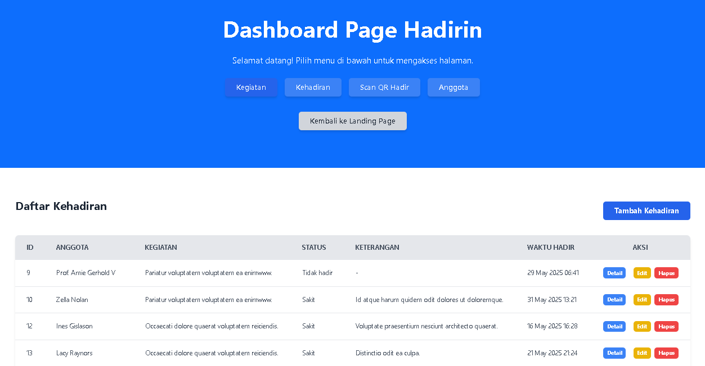
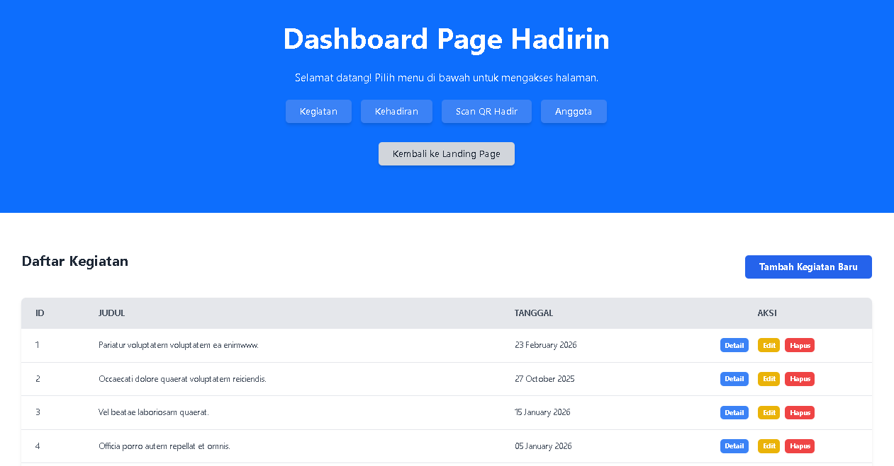
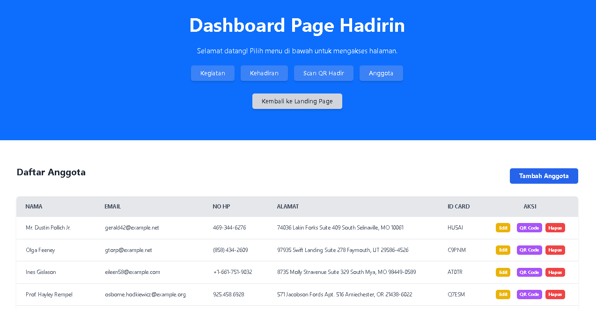
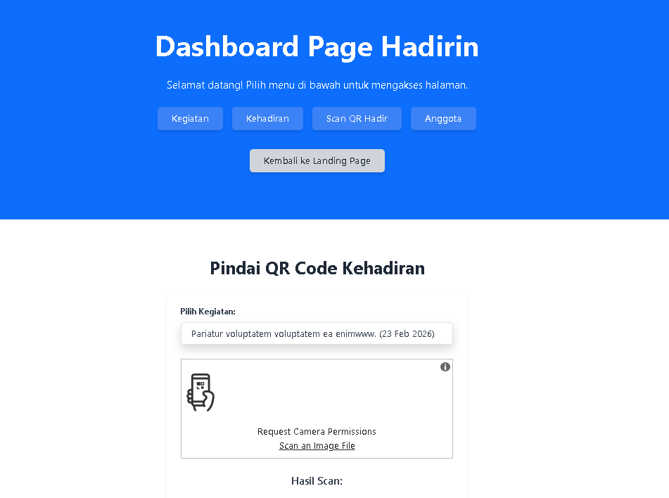

<h1 align="center">Hadirin</h1>







---

## Tech Stack

- **[Laravel 12](https://laravel.com/)**
- **[Tailwind](https://tailwindcss.com/)**

## Prerequisites
- PHP ^8.2
- Composer ^2.2.0
- NPM

## Setup Guide

- Clone project.
```bash
git clone https://github.com/RayanKhairullah/HadirinProject.git
```
- Setup database pada komputer anda, lalu masukkan kredensial-kredensialnya ke file `.env`.
```
DB_CONNECTION=mysql
DB_HOST=127.0.0.1
DB_PORT=3306
DB_DATABASE=hadirindb
DB_USERNAME=root
DB_PASSWORD=
```
- Install dependency.
```bash
composer install
npm install
```
- Generate app key.
```bash
php artisan key:generate
```
- Migrate database.
```bash
# Tanpa seeder
php artisan migrate

# Dengan seeder (data dummy)
php artisan migrate --seed
```
- Jalankan aplikasi.
```bash
php artisan serve
```
> Buka terminal baru, lalu jalankan.
```bash
npm run dev
```
